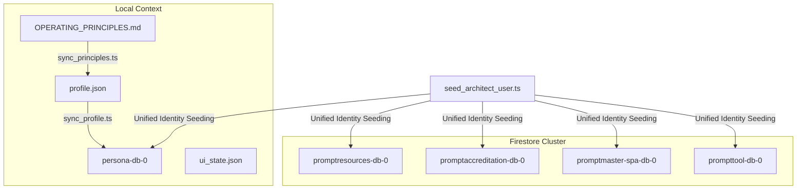

# Stillwater Suite: Comprehensive Architecture, Development, and UI/UX Systems Audit
**Authored by: Sovereign Architect**  
**Ecosystem Version: 4.3**  
**Date: 2026-05-20**

---

## 🏰 Executive Summary
This document provides a highly detailed, multi-perspective systems audit of the **Stillwater Suite** application ecosystem. The audit spans three core disciplines: **Systems Architecture**, **Senior Software Engineering**, and **UI/UX Motion Design**. The analysis inspects the database structures, local-to-cloud synchronization workflows, state integrity boundaries, bundle performance metrics, and cinematic styling layers to prepare the codebase for high-density, multi-tenant development scaling.

---

## 1. 🏰 The Senior Systems Architect Lens

### 1.1. Multitenancy & Decentralization Assessment
The Stillwater Suite utilizes a decoupled, multi-instance database pattern structured around **five dedicated Firestore database nodes** under the `stillwater-sovereign-02` project:
1. `promptresources-db-0` — Resource indexing and deployment configurations.
2. `promptaccreditation-db-0` — Certification registry and audit records.
3. `persona-db-0` — Cognitive profiles and behavioral configuration layers.
4. `promptmaster-spa-db-0` — Core identity records and workspace definitions.
5. `prompttool-db-0` — Master registry tools and analytical telemetry.



* **Identity Seeding Mechanics**: The alignment of user identities is achieved via `seed_architect_user.ts`. This script seeds a single unified Super User (`su`) document matching UID `stqIDYHVcLRxjclsqaksiKMvSXz2` across all five nodes, guaranteeing consistent subscription bundles (`pro-suite` entitlements) and role authorization rules across the entire cluster.
* **Sovereign Engine Synchronization Lifecycle**: Operating principles originate in the markdown document `OPERATING_PRINCIPLES.md`. 
  1. `sync_principles.ts` parses the `## ⚖️ CORE PRINCIPLES` section and updates `/home/heidless/.config/persona/profile.json`.
  2. `sync_profile.ts` reads the local json profile and writes the configurations to the `config` collection under doc `persona_architect` in `persona-db-0`.

### 1.2. State Integrity & Drift Boundaries
* **Single Point of Failure (SPOF)**: The local configuration path `/home/heidless/.config/persona/profile.json` behaves as a rigid caching layer. If this file is corrupted, deleted, or missing, the entire synchronization sequence crashes immediately.
* **Sync Mismatches and Drift**: No bidirectional "pull" mechanism is currently implemented. If configurations in `persona-db-0` are modified directly via the Firebase Console, the local files (`profile.json` and `OPERATING_PRINCIPLES.md`) remain stale. Updates are strictly unidirectional (local-to-cloud).
* **Boot State Mismatch**: The workspace config `ui_state.json` defines the interface mode (`"mode": "sovereign"`). However, `DashboardPage.tsx` initializes `dashboardMode` statically to `'REGISTRY'` upon booting:
  ```typescript
  const [dashboardMode, setDashboardMode] = useState<'SOVEREIGN' | 'REGISTRY' | 'VALIDATION'>('REGISTRY');
  ```
  This causes the interface to boot in standard Registry mode even when the workspace state file requests a Sovereign theme, introducing a visual state integrity mismatch until a manual switch is toggled by the user.

### 1.3. Bridge & Daemon Communication Patterns
* **Rest Interface Boundaries**: The UI queries and commands the local Persona Bridge (running on port `3006`) via standard HTTP fetches exposed in `bridge.ts` (`/profile`, `/observations`, `/observe`, `/command`, `/memory`).
* **Design Bottleneck**: The interaction patterns inside `SovereignNeuralChat.tsx` rely on raw HTTP POST requests (`bridge.sendCommand()`). Lacking WebSockets or Server-Sent Events (SSE), the client has no streaming capabilities for terminal logs or cognitive telemetry, forcing it to await single, bulky request responses.

---

## 2. 🛠️ The Senior Developer Lens

### 2.1. Code Soundness & SOLID Principles
* **State Management & Memoization**: Inside `PromptMasterSPA/src/contexts/AuthContext.tsx`, key operational handlers (`login`, `logout`, `syncWithMaster`, `updateProfile`) are correctly memoized using `useCallback` hooks, preventing unnecessary React component re-renders.
* **Identity Reconciler Sanitization**: The inclusion of `normalizeVal()` in `AuthContext.tsx` prevents false identity conflicts by converting stringified nulls (`'null'`, `'undefined'`) and blank spaces to a standard clean format.
* **Tight Coupling**: Backend bridge addresses (`http://localhost:3006`) are hardcoded in `bridge.ts`. This limits containerized or multi-environment deployments (e.g. dev, staging, production) since environment configurations are not read from an external provider (like `import.meta.env`).

### 2.2. Dependency, Build, & Bundle Performance
A production dry build of `SuiteUtils` compiles cleanly without compile-time errors:
* **Vite Version**: `8.0.10`
* **React version**: `19.2.5`
* **TypeScript version**: `~6.0.2`

```
dist/index.html                     1.07 kB │ gzip:   0.57 kB
dist/assets/index-Dhq7eWrM.css    214.51 kB │ gzip:  26.39 kB
dist/assets/index-OELzPpBz.js   1,308.84 kB │ gzip: 367.24 kB
```

* **Bundle Bottleneck**: Minification succeeds but outputs a single massive JS asset (`index-OELzPpBz.js`) measuring **1.3 MB**—well beyond the recommended limit of 500 kB. Heavy packages like `react-markdown`, `framer-motion`, and `lucide-react` are compiled synchronously into the main entry bundle instead of utilizing lazy load splittings.

### 2.3. Resiliency & Error Handling
* **API Crash Prevention**: Previously, `updateDoc()` calls would fail silently in the browser if any property passed from the profile was parsed as JavaScript `undefined`. The implementation of property validation checks has eliminated client-side database runtime crashes.
* **Autonomous Error Fallbacks**: In `bridge.ts`, if network queries to port 3006 fail (e.g., bridge offline), catch blocks swallow the exception and return standardized fallback values (like raw archetype listings). This maintains an operational and responsive interface posture instead of throwing blocking UI boundary errors.

---

## 3. 🎨 The UI/UX & Motion Design Lens

### 3.1. Design System & Theming Architecture
The Stillwater design tokens, defined in `stillwater-tokens.css` and extended inside Tailwind via `index.css`, adhere to premium, high-fidelity guidelines:
* **Slate/Teal Curated Palette**: Avoids basic primaries. Uses deep slates (`#0f172a`, `#1e293b`) paired with cinematic teals and emeralds (`#0d9488`, `#10b981`) for ambient glow states.
* **Typography**: Modern Outfit displays (`font-family: 'Outfit'`) paired with clean Inter bodies, ensuring strong structural spacing and readability under high information density.
* **Glassmorphism surfaces**: Handled via `.glass-panel` and `.glass-card` containing `backdrop-filter: blur(40px)` combined with subtle white border overlays (`border: 1px solid rgba(255, 255, 255, 0.05)`), producing professional, layered UI depth.

### 3.2. Micro-interactions & Kinetic Feedback
* **Smooth CSS Transitions**: Animations like `fadeInUp` and `fadeInRight` utilize custom bezier properties (`cubic-bezier(0.16, 1, 0.3, 1)`) to deliver fluid transitions.
* **Glow Pulses**: The `pulseGlow` keyframe animation applies responsive box-shadow pulses to active state indicators, highlighting system statuses elegantly.
* **Framer Motion Overlays**: Dynamic modal states (`PrinciplesModal.tsx` and the purge confirmation overlay in `SovereignNeuralChat.tsx`) use `<AnimatePresence>` to orchestrate entering and exiting transition states seamlessly.

### 3.3. Custom Chat Layout & Footprint
* **Minimized Default Footprint**: `SovereignNeuralChat.tsx` boots to a minimized dock state (`w-72 h-16`) at `fixed bottom-6 right-6 z-[200]`, maintaining a low visual footprint during primary telemetry monitoring.
* **High-Density Expansion**: Clicking the header expands the interface to a detailed panel (`w-[400px] h-[600px]`), sliding open standard message lists, inputs, and a custom Markdown container that renders code blocks with styled syntax highlighting.

---

## 4. 🛠️ Actionable Refactoring Roadmap

### Phase 1: High Priority (State & Architecture Integrity)
* [ ] **Bidirectional Profile Sync**: Refactor `sync_profile.ts` or add a `pull_profile.ts` command to enable synchronizing modifications from `persona-db-0` config back into local `profile.json` and `OPERATING_PRINCIPLES.md`.
* [ ] **Boot State Alignment**: Modify `DashboardPage.tsx`'s initialization of `dashboardMode` to query the workspace state API or directly parse `/api/state` on mount to avoid Registry/Sovereign boot divergence.
* [ ] **Bridge Endpoint Environment Binding**: Replace hardcoded `http://localhost:3006` values in `bridge.ts` with dynamically parsed configurations:
  ```typescript
  const BRIDGE_URL = import.meta.env.VITE_BRIDGE_URL || 'http://localhost:3006';
  ```

### Phase 2: Medium Priority (Developer Ergonomics & Performance)
* [ ] **Vite Code-Splitting Optimization**: Update `vite.config.ts` to implement code splitting rules, splitting heavy third-party assets (`framer-motion`, `react-markdown`, `lucide-react`) into dynamic lazy loaded chunks to bring the main JS bundle below the 500 kB threshold.
* [ ] **Bridge WebSocket Streaming**: Implement simple WebSockets or SSE listeners on the bridge port 3006 backend, and bind them to the message board in `SovereignNeuralChat` to allow real-time prompt generation streaming instead of raw block-wait HTTP logs.

### Phase 3: Low Priority (UX Refinements)
* [ ] **Skeletal Load Expansion**: Introduce modular, pulse-shimmering skeletons inside the Observational Feed when fetching database lists to prevent sudden visual component popping.
* [ ] **Dynamic Theme Synchronization**: Allow instant hot-swapping of styling class hierarchies when `ui_state.json` updates, propagating changes immediately across active tabs without needing full client reloads.

---
🏰✨🎯🦾 *System Audit Execution Sequence Terminated.*
