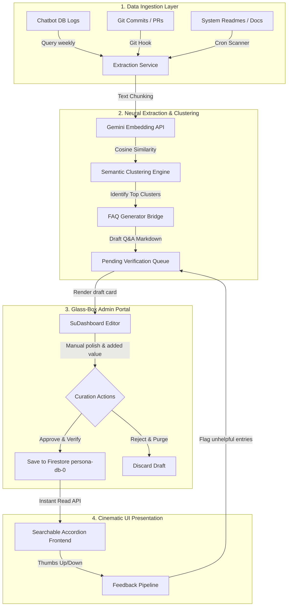

# 🌌 Stillwater Sovereign FAQ Engine: Implementation Blueprint

This blueprint outlines the complete system architecture, database schematics, API designs, and week-by-week engineering milestones required to build and deploy the **Semi-Automated Hybrid Ingestion & Curation FAQ Engine** inside the Stillwater Suite.

---

## 🏗️ System Architecture & Data Flow

---

## 📅 Week-by-Week Milestones

### 📍 Phase 1: Ingestion & Extraction (Automated Discovery)
*Objective: Build the backend daemons to extract, cluster, and draft FAQs from raw conversational logs and repository documentation.*

#### **Tasks & Abstractions:**
1. **Log Parser Script (`scripts/parse_chat_logs.ts`)**:
   * Connects to SQLite/Firestore logs and extracts message payloads.
   * Runs a regex/sentence tokenizer to identify question structures ending with `?`.
2. **Clustering Daemon (`server/services/FaqClusteringService.ts`)**:
   * Batch-sends questions to the `text-embedding-004` endpoint.
   * Groups questions into mathematical clusters using a simple k-means or DBSCAN threshold (cosine similarity > 0.82).
3. **Drafting Bridge (`server/services/FaqGeneratorBridge.ts`)**:
   * Sends the top 5 questions in each cluster to Gemini 2.5 Flash.
   * Prompts the model to return a single, professional Q&A pair combining the intent of the entire cluster, formatted in clean Markdown.
   * Saves raw drafts to the `faq_drafts` Firestore collection.

---

### 📍 Phase 2: The Glass-Box Admin Dashboard (Added-Value Curation)
*Objective: Provide a secure, premium admin UI where the developer can inspect, edit, enrich, and approve FAQ drafts before they go live.*

#### **Tasks & Abstractions:**
1. **Glass-Box Card Grid (`src/components/dashboard/faq/DraftQueue.tsx`)**:
   * A cinematic, glassmorphic card array displaying each drafted FAQ.
   * Highlights the "Confidence Rating" and shows the source logs that generated this question.
2. **Inline WYSIWYG Editor (`src/components/dashboard/faq/FaqEditorModal.tsx`)**:
   * Facilitates adding your expert "added value": code-block injection with highlighting, deep links to source code, and structural polish.
3. **Database Write Transaction**:
   * Once approved, write the sanitized payload to the live `faq` production collection with a metadata flag: `verified: true`, `lastCuratedAt: timestamp`, and `approvedBy: "Architect"`.

---

### 📍 Phase 3: Premium Frontend Accordion & Search
*Objective: Deploy a gorgeous, spring-animated, lightning-fast client UI for end users.*

#### **Tasks & Abstractions:**
1. **Interactive Glass Accordion (`src/components/faq/FaqAccordion.tsx`)**:
   * Styled in sleek dark mode with subtle neon violet shadows.
   * Powered by **Framer Motion** for physics-based fluid height transitions on expansion.
2. **Fuzzy Search & Semantic Fallback (`src/hooks/useFaqSearch.ts`)**:
   * Incorporates an instant fuzzy search using **MiniSearch** on the client.
   * *Fallback Layer*: If search results yield 0 matches, perform an on-demand vector cosine similarity match against the FAQ embeddings, returning the most semantically relevant answer instantly with a "Close Match" disclaimer.

---

### 📍 Phase 4: Feedback Loops & Analytical Insights
*Objective: Complete the self-improving loop by monitoring visitor interactions and flag fading answers.*

#### **Tasks & Abstractions:**
1. **Helpfulness Counter (`src/components/faq/FaqFeedback.tsx`)**:
   * Seamless inline 👍 / 👎 feedback buttons.
2. **Negative Feedback Watchdog**:
   * If an FAQ receives a negative score ratio below 70% helpfulness:
     * Automate a flag `needsRevision: true`.
     * Instantly push the entry back to the **Glass-Box Admin Portal** with a critical visual highlight to notify you that the answer needs updates!

---

## 🔒 Verification & Quality Assurance Backlog

To verify that the FAQ system maintains the rigorous standard of the Stillwater Suite, the following 5-point verification backlog must pass testing:

- `[ ]` **VAL-FAQ-001**: Verify that the semantic clustering engine successfully merges different wordings of the same question (e.g., "how to sync" vs "sync command help") into a single draft.
- `[ ]` **VAL-FAQ-002**: Confirm that manual edits made inside the Glass-Box Dashboard take absolute authority and are never overwritten by subsequent extraction cron cycles.
- `[ ]` **VAL-FAQ-003**: Measure frontend transition smoothness under simulated 30 FPS throttle; accordion animations must remain glitch-free and visually continuous.
- `[ ]` **VAL-FAQ-004**: Verify semantic fallback capability: searching for a synonym (e.g., "credential" instead of "api key") successfully pulls the closest vector FAQ match.
- `[ ]` **VAL-FAQ-005**: Confirm that a high-rate negative feedback sequence triggers the `needsRevision` flag and highlights the card inside the admin dashboard.
